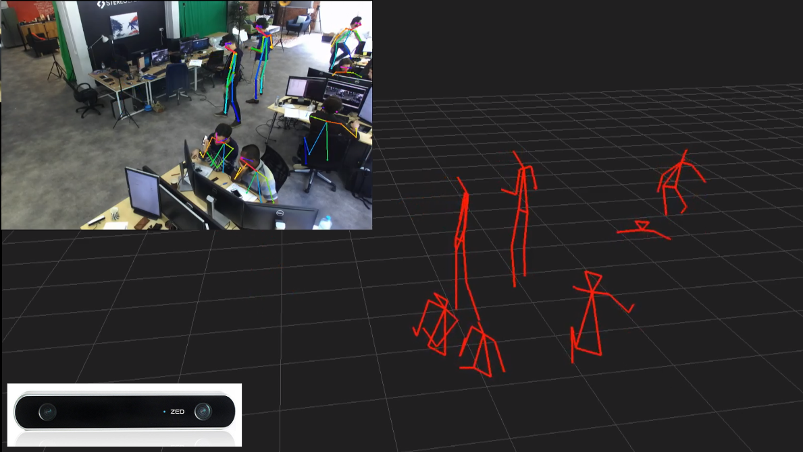

# OpenPose ZED

This sample show how to simply use the ZED with [OpenPose](https://github.com/CMU-Perceptual-Computing-Lab/openpose), the deep learning framework that detects the skeleton from a single 2D image. The 3D information provided by the ZED is used to place the joints in space.
The output is a 3D view of the skeletons.

## Installation

### Openpose

This sample can be put in the folder [`examples/user_code/`](https://github.com/CMU-Perceptual-Computing-Lab/openpose/tree/master/examples/user_code) **OR** preferably, compile and _install_ openpose with the cmake and compile this anywhere

The installation process is very easy using cmake.

Clone the repository :

        git clone https://github.com/CMU-Perceptual-Computing-Lab/openpose/
        
Build and install it :
        
        cd openpose
        mkdir build
        cmake .. # This can take a while
        make -j8
        sudo make install

### ZED SDK

The ZED SDK is also a requirement for this sample, [download the ZED SDK](https://www.stereolabs.com/developers/release/latest/) and follows the [instructions](https://docs.stereolabs.com/overview/getting-started/installation/).

It requires ZED SDK 2.4 for the floor plane detection but can be easily [disabled](src/main.cpp#L99) to use an older ZED SDK version.

### Build the program

Open a terminal in the sample directory and execute the following command:

        mkdir build
        cd build
        cmake ..
        make -j8

We then need to make a symbolic link to the models folder to be able to loads it

        ln -s ~/path/to/openpose/models "$(pwd)"
        
A `models` folder should now be in the build folder

## Run the program

- Navigate to the build directory and launch the executable
- Or open a terminal in the build directory and run the sample :

        ./zed_openpose

## Options

Beyond the openpose option, several more were added, mainly:

Option             | Description
---------------------|------------------------------------
svo_path     | SVO file path to load instead of opening the ZED
ogl_ptcloud             | Boolean to show the point cloud in the OpenGL window
estimate_floor_plane       | Boolean to align the point cloud on the floor plane
opencv_display    | Enable the 2D View of OpenPose output
depth_display    | Display the depth map with OpenCV

Example :

        ./zed_openpose -net_resolution 320x240 -ogl_ptcloud true -svo_path ~/foo/bar.svo

## Notes

- This sample is a proof of concept and might not be robust to every situation, especially to detect the floor plane if the environment is cluttered.
- This sample was only tested on Linux but should be easy to run on Windows.
- This sample requires both Openpose and the ZED SDK which are heavily relying on the GPU.
- Only the body keypoints are currently used, however we could imagine doing the same for hand and facial keypoints, though the precision required might be a limiting factor.
